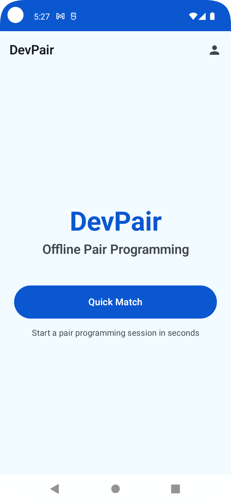
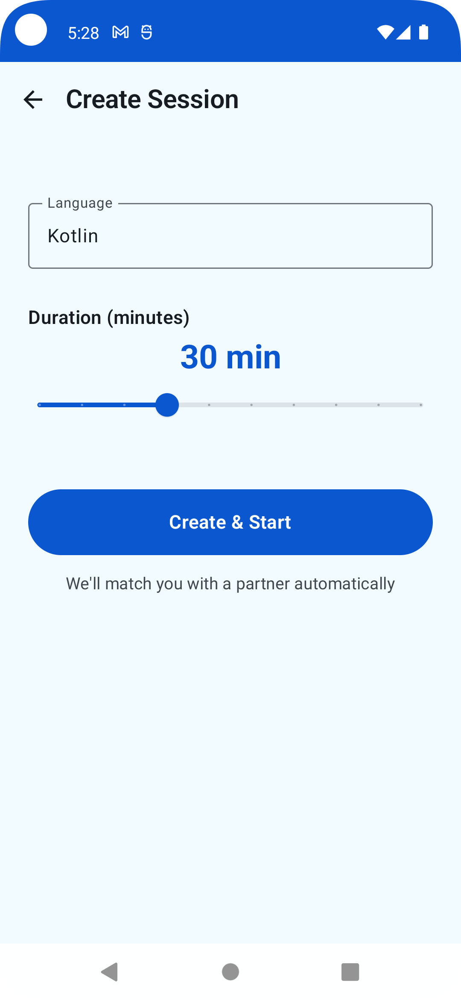
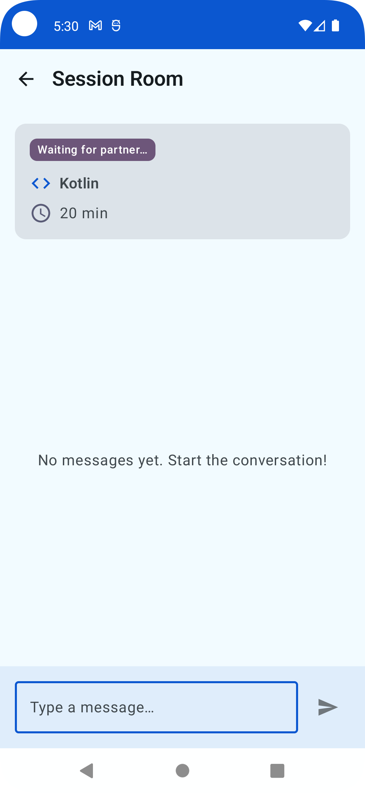

# DevPair (Offline)

**Android pair programming demo app** – Works completely offline with local persistence and simulated realtime updates.

---

## � Screenshots

<div align="center">

   

*Home • Create Session • Chat Room • Users*

</div>

---

## �📱 Overview

DevPair is an Android app that lets you start a **simulated pair programming session** in seconds. Users create a session (language + duration), the system performs a quick match, and opens a chat room with a timer. Everything works **completely offline** thanks to Room local persistence and "fake realtime" based on Kotlin Flow.

---

## ✨ Features (MVP)

### 🏠 Home
- Prominent "Quick Match" CTA button
- Navigation to Profile

### 🔍 Match
- Input: programming language (free text)
- Slider: duration 15–60 minutes
- Action: "Create & Start" → creates session in Room DB
- Auto-match after ~3 seconds (status changes to ONGOING)

### 💬 Room
- Message list ordered by timestamp
- Text input + "Send" button
- Local bot that responds "Echo: <text>" after ~3 seconds
- Shows session info: language, duration, status
- Auto-scroll on new messages

### 👤 Profile
- Shows current user profile (mock)
- List of seed users with avatar, bio, level, languages

---

## 🛠 Tech Stack

| Layer | Technologies |
|-------|-----------|
| **UI** | Jetpack Compose, Material 3, Navigation Compose |
| **Architecture** | MVVM, Single Activity, Repository Pattern |
| **DI** | Hilt |
| **Persistence** | Room Database (users, sessions, messages) |
| **Preferences** | DataStore |
| **Concurrency** | Kotlin Coroutines, Flow, StateFlow |
| **Realtime Fake** | Ticker Flow (3s interval) |

### Specifications
- **MinSdk**: 24
- **TargetSdk**: 35
- **Kotlin**: 1.9.23
- **Compose**: BOM 2024.02.00
- **Compose Compiler**: 1.5.11
- **AGP**: 8.2.2
- **Hilt**: 2.50
- **Room**: 2.6.1

---

## 🚀 Setup & Run

### Prerequisites
- Android Studio Hedgehog+ (2023.1.1+)
- JDK 17
- Android SDK 35

### Installation

1. Open Android Studio
2. File → Open → Select the `dev_pair` folder
3. Wait for Gradle sync to complete (downloads ~200MB dependencies)
4. Click Run (Shift+F10) or the green play button
5. Select an emulator or connected device
6. The app will build and launch automatically

### Build from Terminal (Windows PowerShell)

```powershell
# Build debug APK
.\gradlew.bat assembleDebug

# APK will be in: app\build\outputs\apk\debug\app-debug.apk
```

---

## 📂 Project Structure

```
app/src/main/java/com/devpair/offline/
│
├── data/
│   ├── local/
│   │   ├── dao/              # UserDao, SessionDao, MessageDao
│   │   ├── entity/           # Entity + Mapper
│   │   └── DevPairDatabase   # Room DB
│   ├── repository/           # Repositories with fake realtime
│   └── util/                 # RealtimeTicker
│
├── di/                       # Hilt modules (Database, DataStore)
│
├── domain/
│   └── model/                # User, Session, Message, Enums
│
├── ui/
│   ├── components/           # MessageRow, SessionInfo
│   ├── feature/
│   │   ├── home/            # HomeScreen + ViewModel
│   │   ├── match/           # MatchScreen + ViewModel
│   │   ├── room/            # RoomScreen + ViewModel
│   │   └── profile/         # ProfileScreen + ViewModel
│   ├── navigation/          # NavGraph, Screen routes
│   └── theme/               # Color, Type, Theme (Material3)
│
├── DevPairApplication        # Hilt entry point
└── MainActivity              # Single Activity + Compose
```

---

## 🗄 Database Schema (ASCII ER)

```
┌─────────────────────────┐
│       USERS             │
├─────────────────────────┤
│ id (PK)                 │
│ displayName             │
│ avatarUrl               │
│ bio                     │
│ languages (CSV)         │
│ level (JUNIOR/MID/SENIOR)│
└─────────────────────────┘
          │
          │ 1:N (hostId)
          │
┌─────────────────────────┐
│      SESSIONS           │
├─────────────────────────┤
│ id (PK)                 │
│ hostId (FK → users)     │
│ guestId (FK → users)    │
│ language                │
│ durationMinutes         │
│ status (WAITING/ONGOING/FINISHED) │
│ startedAt               │
│ finishedAt              │
└─────────────────────────┘
          │
          │ 1:N (sessionId)
          │
┌─────────────────────────┐
│      MESSAGES           │
├─────────────────────────┤
│ id (PK)                 │
│ sessionId (FK → sessions)│
│ senderId (FK → users)   │
│ text                    │
│ timestamp               │
└─────────────────────────┘
```

---

## 🎬 Demo Flow

1. **Launch app** → Home Screen
2. **Tap "Quick Match"** → Match Screen
3. **Enter "Kotlin"** + **Slider to 30 min** → Tap "Create & Start"
4. **Auto-navigate to Room** → Status: WAITING
5. **After ~3 seconds** → Guest assigned, status: ONGOING
6. **Type "Hello!"** → Send
7. **After ~3 seconds** → Bot responds "Echo: Hello!"
8. **Close and reopen app** → Session and messages persisted ✅

---

## 📸 Screens Wireframe

### Home Screen
```
┌─────────────────────────────┐
│  DevPair            [👤]    │  ← TopBar
├─────────────────────────────┤
│                             │
│      📱 DevPair             │  ← Title
│   Offline Pair Programming  │  ← Subtitle
│                             │
│   ┌─────────────────────┐   │
│   │   Quick Match       │   │  ← CTA Button
│   └─────────────────────┘   │
│                             │
│  Start a pair programming   │
│  session in seconds         │
│                             │
└─────────────────────────────┘
```

### Match Screen
```
┌─────────────────────────────┐
│ ← Create Session            │  ← TopBar
├─────────────────────────────┤
│                             │
│  Language:                  │
│  ┌─────────────────────┐    │
│  │ Kotlin              │    │  ← TextField
│  └─────────────────────┘    │
│                             │
│  Duration (minutes):        │
│       30 min                │  ← Slider value
│  ├──────●──────────────┤    │  ← Slider (15-60)
│                             │
│   ┌─────────────────────┐   │
│   │  Create & Start     │   │  ← Button
│   └─────────────────────┘   │
│                             │
│  We'll match you with a     │
│  partner automatically      │
│                             │
└─────────────────────────────┘
```

### Room Screen
```
┌─────────────────────────────┐
│ ← Session Room              │  ← TopBar
├─────────────────────────────┤
│ ┌─────────────────────────┐ │
│ │ ⏱ Session Ongoing       │ │  ← SessionInfo Card
│ │ 💻 Kotlin               │ │
│ │ ⏰ 30 min               │ │
│ └─────────────────────────┘ │
├─────────────────────────────┤
│                             │
│  [G] Giulia: Ciao!          │  ← Messages
│                             │
│            Hello!  [M]      │  ← Current user
│                             │
│  [🤖] DevBot: Echo: Hello!  │  ← Bot reply
│                             │
├─────────────────────────────┤
│ ┌─────────────────────┐ [📤]│  ← Input + Send
│ │ Type a message...   │     │
│ └─────────────────────┘     │
└─────────────────────────────┘
```

### Profile Screen
```
┌─────────────────────────────┐
│ ← Profile                   │  ← TopBar
├─────────────────────────────┤
│ Your Profile                │
│ ┌─────────────────────────┐ │
│ │ [M] Marco Rossi         │ │  ← Current user
│ │ Full-stack developer    │ │
│ │ 🏅 SENIOR               │ │
│ │ Kotlin, Java, TypeScript│ │
│ └─────────────────────────┘ │
│                             │
│ All Users                   │
│ ┌─────────────────────────┐ │
│ │ [G] Giulia Bianchi      │ │
│ │ Android enthusiast      │ │
│ │ 🏅 MID                  │ │
│ └─────────────────────────┘ │
│ ┌─────────────────────────┐ │
│ │ [L] Luca Verdi          │ │
│ │ Learning backend dev    │ │
│ │ 🏅 JUNIOR               │ │
│ └─────────────────────────┘ │
│ ┌─────────────────────────┐ │
│ │ [🤖] DevBot             │ │
│ │ Your friendly assistant │ │
│ │ 🏅 SENIOR               │ │
│ └─────────────────────────┘ │
└─────────────────────────────┘
```

---

## 🎯 Acceptance Criteria (MVP)

✅ App launches offline without crashes  
✅ Can create a session and navigate to Room  
✅ Can send messages and receive bot response within 3 seconds  
✅ Close and reopen app: session and messages persist (Room persistence)  
✅ Modern Material3 UI, readable and polished  
✅ Accessibility: contentDescription for interactive elements  
---

## 🔮 Future Enhancements

- [ ] **Session history** with filters and search
- [ ] **Visual timer** with animated progress bar and expiry notification
- [ ] **Edit profile**: name, bio, avatar from local storage
- [ ] **Local leaderboard** with statistics (completed sessions, messages sent)
- [ ] **Theme switcher** (system/light/dark) via DataStore
- [ ] **Export sessions** in JSON format
- [ ] **Compose UI tests** (ui-test-junit4)
- [ ] **Unit tests** for repositories and ViewModels
- [ ] **CI/CD** with GitHub Actions
- [ ] **i18n** for multi-language support
- [ ] **Offline analytics** (Firebase Crashlytics offline mode)
- [ ] **Backup/restore** database via file export

---

## 📄 License

Demo project for portfolio/hackathon purposes. No specific license.

---


